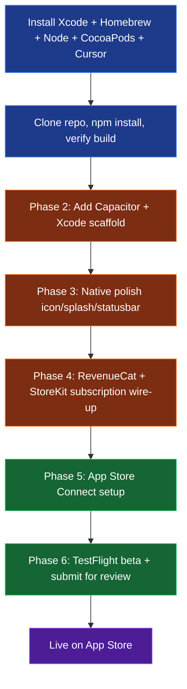

# HANDOFF — BCBA Interactive Study Workbook · iOS build

> **Purpose:** Single source of truth for continuing this project after switching from Windows to macOS.
> When you clone this repo on your Mac and start a fresh Cursor chat, paste the prompt in
> the [PROMPT TO START A FRESH CHAT](#prompt-to-start-a-fresh-chat) section and the new
> agent will have everything it needs to pick up exactly where we left off.

- **GitHub repo:** https://github.com/sarasmithmft-del/bcba-study-app
- **Bundle ID:** `com.euphoria.bcbaworkbook`
- **Marketing name:** `BCBA Study Workbook`
- **Pricing model:** 3-day free trial → $9.99/month auto-renewing subscription (via RevenueCat + StoreKit 2)
- **Distribution:** Apple App Store (Apple Developer Program membership already active)

---

## Where we are (state as of 2026-07-21)

### Windows-side · DONE

- [x] All 37 chapter modules authored (readings, key concepts, applied vignettes, quiz banks)
- [x] Two full 185-item BCBA mock exams with TCO A–I domain coverage
- [x] Cross-exam history dashboard (session-scoped attempt tracking)
- [x] TCO weight-check dashboard on mock exam results
- [x] SAFMEDS decks (curated for mod01 + mod03, vocab-derived for the rest)
- [x] **Static export** configured (`next.config.ts` with `output: "export"`, `trailingSlash: true`)
- [x] IndexedDB-backed on-device attempt persistence (no server needed)
- [x] Prisma + Postgres removed (121 packages pruned from node_modules)
- [x] Subscription surface built (client stub, hook, gate, `/subscribe`, `/settings`, `/privacy`)
- [x] Local git repo initialized + first commit + pushed to GitHub

### Mac-side · TO DO



---

## Design decisions locked in (do not re-litigate)

| Decision | Value | Why |
|---|---|---|
| Framework | Next.js 16 + React 19, static export (`output: "export"`) | Ships as a pure HTML/JS bundle that Capacitor's iOS WebView serves offline |
| Data persistence | IndexedDB via `src/lib/storage/attemptsStore.ts` | Zero server, works offline, will swap to Capacitor SQLite for iOS in Phase 3 if needed |
| Native wrapper | Capacitor (not React Native, not Expo) | Reuses the Next.js output verbatim, minimal Swift required |
| Subscription tooling | RevenueCat + StoreKit 2 | Handles receipt validation, restores, and trial logic; Apple-compliant out of the box |
| Subscription product | Monthly, $9.99, 3-day intro free trial | Priced for individual test-preppers, matches competitors |
| Bundle ID | `com.euphoria.bcbaworkbook` | Reverse-DNS of the developer identity; must match App Store Connect |
| iOS deployment target | iOS 16.0 | RevenueCat + modern StoreKit 2 require iOS 15+; 16 gives us modern SwiftUI/WebKit APIs |
| Content-only auth | None | No user accounts, no cloud sync — keeps privacy label as "Data Not Collected" |
| TCO domain schema | A–I (all 9 domains per BACB 6th ed. TCO) | Extended in this codebase from the older A–G to match current exam blueprint |

---

## Mac-side setup · Step by step

### Step 1 · Install prerequisites (30–90 min, mostly waiting on Xcode)

**1a. Xcode (start this first — biggest download)**

- Open the **App Store** app on Mac
- Search **Xcode**, click **Get**, then **Install**
- ~15 GB download, allow 30–90 min depending on connection
- When it finishes, **open Xcode once** to let it install additional components (5–10 min)
- Accept the license from Terminal so we can run headless later:
  ```bash
  sudo xcodebuild -license accept
  ```

**1b. Homebrew (Mac's package manager)**

Open **Terminal** (⌘+Space → type `terminal` → Enter):

```bash
/bin/bash -c "$(curl -fsSL https://raw.githubusercontent.com/Homebrew/install/HEAD/install.sh)"
```

Follow the on-screen instructions at the end (it will tell you two `echo` lines to run to add brew to your PATH). Run those.

**1c. Node.js 20 + git + CocoaPods**

```bash
brew install node@20 git
echo 'export PATH="/opt/homebrew/opt/node@20/bin:$PATH"' >> ~/.zshrc
source ~/.zshrc
node --version   # should print v20.something
sudo gem install cocoapods
pod --version    # should print 1.15+
```

**1d. Cursor for Mac** (so you can continue this exact project with AI help)

- Download from https://cursor.com/download
- Sign in with the same account you used on Windows

### Step 2 · Get the code (5 min)

In Terminal:

```bash
mkdir -p ~/Projects && cd ~/Projects
git clone https://github.com/sarasmithmft-del/bcba-study-app.git
cd bcba-study-app
npm install     # ~2 min
npm run build   # ~30 sec — verifies the static export works on your Mac
```

If `npm run build` ends with a "Route (app)" table showing 42 pages, you're ready for Phase 2.

Then open the folder in Cursor:

```bash
open -a Cursor .   # or: File → Open Folder → ~/Projects/bcba-study-app
```

### Step 3 · Start a fresh Cursor chat with the handoff prompt

See [PROMPT TO START A FRESH CHAT](#prompt-to-start-a-fresh-chat) below.

---

## Phase-by-phase roadmap (Mac)

### Phase 2 · Add Capacitor + Xcode scaffold (~30 min)

Commands the AI will run (all inside `~/Projects/bcba-study-app`):

```bash
npm install @capacitor/core @capacitor/cli @capacitor/ios @capacitor/status-bar @capacitor/splash-screen
npx cap init "BCBA Study Workbook" com.euphoria.bcbaworkbook --web-dir=out
npm run build           # regenerates the /out static export
npx cap add ios         # creates /ios/App/ Xcode project
npx cap sync ios        # copies web assets + updates native deps via CocoaPods
npx cap open ios        # opens Xcode
```

**In Xcode (one-time setup — the AI will walk you through this UI):**

- Left sidebar → click the top-level **App** project (blue icon)
- Center panel → **Signing & Capabilities** tab
  - Team: pick your Apple Developer team (dropdown auto-populates)
  - Bundle Identifier: verify it reads `com.euphoria.bcbaworkbook`
  - "Automatically manage signing" should be checked
- General tab → **Minimum Deployments** → iOS `16.0`
- Top-left → dropdown next to ▶ Run → pick **iPhone 15 Pro** (or any simulator)
- Click ▶ Run
- The Simulator app opens and boots iOS; ~30 sec later your app launches showing the home page

If the app runs, Phase 2 is done.

### Phase 3 · Native polish (~1 hour)

Deliverables:
- **App icon** — 1024×1024 PNG generated from workbook branding (AI can generate one)
- **Splash screen** — dark themed matching the `aba-depth` background
- **Status bar** — light content on dark background via `@capacitor/status-bar` config
- **Safe-area CSS** — inset padding for the notch (already scaffolded in `src/app/layout.tsx`)
- Offline indicator that appears when device drops connectivity

### Phase 4 · Subscription wiring (~2 hours)

Prerequisites (do these in your browser at [appstoreconnect.apple.com](https://appstoreconnect.apple.com)):

1. **Register the app**
   - My Apps → **+** → **New App**
   - Platform: **iOS**
   - Name: **BCBA Study Workbook**
   - Primary Language: **English (U.S.)**
   - Bundle ID: `com.euphoria.bcbaworkbook` (select from dropdown after registering it in the [Apple Developer Portal](https://developer.apple.com/account/resources/identifiers/list) → Identifiers → +)
   - SKU: `bcbaworkbook-ios` (any unique string, private to you)

2. **Create the subscription product**
   - Inside the new app → **Subscriptions** (left sidebar)
   - Create subscription group: **"BCBA Workbook Pro"**
   - Create subscription:
     - Reference Name: `Monthly Pro`
     - Product ID: `monthly_pro` (must match `src/lib/subscription/subscriptionClient.ts` `MONTHLY_OFFERING.productId`)
     - Duration: 1 Month
     - Price: $9.99 (Tier 10)
   - Add **Introductory Offer**: Free trial, 3 days
   - Fill localized display name, description, review screenshot

3. **Create RevenueCat account** at [app.revenuecat.com](https://app.revenuecat.com) (free tier fine to start)
   - Create project → add app with bundle id `com.euphoria.bcbaworkbook`
   - Get **Public SDK Key** (starts with `appl_`)
   - Wire product `monthly_pro` into a RevenueCat **Offering** named `default`

Code changes the AI will make:

```bash
npm install @revenuecat/purchases-capacitor
npx cap sync ios
```

Then rewrite `src/lib/subscription/subscriptionClient.ts` — replace the localStorage stub with real RevenueCat SDK calls. The public interface (`isEntitled`, `getOffering`, `startTrial`, `restorePurchases`) stays identical. And activate the gate in one line inside `src/app/layout.tsx`:

```tsx
import { SubscriptionGate } from "@/components/subscription/SubscriptionGate";
// ...
<body>
  <SubscriptionGate>{children}</SubscriptionGate>
</body>
```

Test with a **Sandbox tester** created in App Store Connect → Users and Access → Sandbox Testers.

### Phase 5 · App Store Connect prep (~2 hours)

Assets to prepare (AI can help you draft copy and generate placeholder screenshots):

- **App icon** — 1024×1024 PNG (final, no transparency, no rounded corners)
- **Screenshots** — 3 required sizes:
  - 6.7" (iPhone 15/16 Pro Max) — 1290 × 2796
  - 6.5" (iPhone 15/16 Plus) — 1284 × 2778
  - 5.5" (iPhone 8 Plus) — 1242 × 2208
  - Minimum 2, maximum 10 per size; screenshot 3–4 key screens (home, module, mock exam, results dashboard)
- **App description** (up to 4000 chars) — sell it
- **Keywords** (100 chars, comma-separated) — e.g. `BCBA,ABA,behavior,analyst,exam,study,Cooper,BACB,SAFMEDS,mock`
- **Category** — Primary: Education; Secondary: Reference
- **Age rating** — 4+
- **Privacy Nutrition Labels** — **"Data Not Collected"** (matches the `/privacy` page in this codebase)
- **Subscription review notes** — one paragraph explaining "3-day trial → $9.99/month" so Apple's reviewer understands the flow
- **Sandbox tester account** for the reviewer

### Phase 6 · TestFlight + submit for review (~1 hour + wait)

In Xcode:

1. Top menu → **Product → Archive** (make sure device dropdown = "Any iOS Device (arm64)", not a simulator)
2. Wait ~2–5 min for the archive to build
3. **Organizer** window auto-opens → click **Distribute App**
4. Select **App Store Connect** → **Upload** → follow prompts
5. Wait 5–15 min for App Store Connect to process the upload
6. In App Store Connect → your app → **TestFlight** tab → install on your device via TestFlight app
7. Run through: paywall → trial → app usage → cancel from Settings → verify entitlement drops
8. Back in App Store Connect → **App Store** tab → fill in the build (attach the uploaded one) → **Submit for Review**

Expected review turnaround: 24–48 hours. If rejected, Apple gives specific feedback; iterate.

---

## Common gotchas and how the AI should handle them

| Problem | Root cause | Fix |
|---|---|---|
| Build fails with "output export not compatible with API routes" | An API route was added somewhere | Delete it; static export can't have server-only routes |
| Xcode signing fails with "no team selected" | Xcode not signed into Apple ID | Xcode → Settings → Accounts → **+ Apple ID** |
| CocoaPods install errors during `npx cap sync ios` | Ruby version mismatch | `sudo gem install cocoapods` (never use system-installed pods on Mac) |
| App boots but chapters list is empty | The `/out` folder wasn't rebuilt after edits | Run `npm run build && npx cap sync ios` — every code change requires both |
| Subscription buttons do nothing in Simulator | StoreKit sandbox not configured | Xcode → **Editor → Enable StoreKit Sandbox** while running |
| App rejected by Apple with "3.1.2: subscription info missing" | Paywall copy lost required disclosure text | Verify `/subscribe/page.tsx` still has the "auto-renews … Manage in Settings > Apple ID" paragraph |
| Free trial doesn't show in Sandbox | Sandbox tester already used the trial | Create a fresh Sandbox tester in App Store Connect → Users and Access → Sandbox |

---

## Key files the AI needs to know about

| Path | Purpose |
|---|---|
| `next.config.ts` | Static export config — do not add server-only features |
| `src/app/layout.tsx` | Root layout; wrap children in `<SubscriptionGate>` for Phase 4 |
| `src/app/page.tsx` | Home page with 31 chapter list + 2 mock exams |
| `src/app/subscribe/page.tsx` | Paywall UI (already built, Apple-compliant copy) |
| `src/app/settings/page.tsx` | Subscription management + restore + privacy links |
| `src/app/privacy/page.tsx` | Privacy policy; keep in sync with App Store nutrition labels |
| `src/lib/subscription/subscriptionClient.ts` | **Single file to swap in Phase 4** — replace stub with RevenueCat SDK |
| `src/lib/subscription/useSubscription.ts` | React hook — callers should not need to change |
| `src/components/subscription/SubscriptionGate.tsx` | Route guard — activate in layout in Phase 4 |
| `src/lib/storage/attemptsStore.ts` | IndexedDB persistence for study attempts (Capacitor SQLite swap optional) |
| `src/lib/mockExamHistory.ts` | Client-side aggregator over `attemptsStore` |
| `src/content/modules/` | All 37 chapter blueprints — do not touch during iOS work |
| `src/content/mockExam/` | Mock exam definitions — do not touch |

---

## PROMPT TO START A FRESH CHAT

When you're on the Mac with Cursor open on the cloned repo, start a new chat and paste this verbatim:

> Read `HANDOFF.md` in the repo root — that's the state of this project. I'm on macOS now, and my goal is to publish this to the Apple App Store. The Windows-side work (static export, on-device storage, subscription UI, GitHub push) is done. We need to complete Phase 2 (add Capacitor + scaffold Xcode project). Confirm you've read the handoff, then run the Phase 2 commands and walk me through the Xcode signing step. My Apple Developer team is already active. My bundle ID is `com.euphoria.bcbaworkbook`.

That prompt gives a fresh agent everything it needs — no re-explaining, no missing context.

---

## What I've locked in this file so you don't have to re-decide

- App name, bundle ID, price, trial length, iOS min version
- Which subscription tooling (RevenueCat)
- Which native wrapper (Capacitor)
- Which persistence (IndexedDB now → optionally Capacitor SQLite later)
- Full Xcode setup steps
- Full App Store Connect setup steps
- Which files are safe to edit vs. off-limits
- Common failure modes + fixes

If a fresh AI ever second-guesses any of these, point it back at this file.

---

_Last updated: 2026-07-21 · Windows-side handoff commit_
